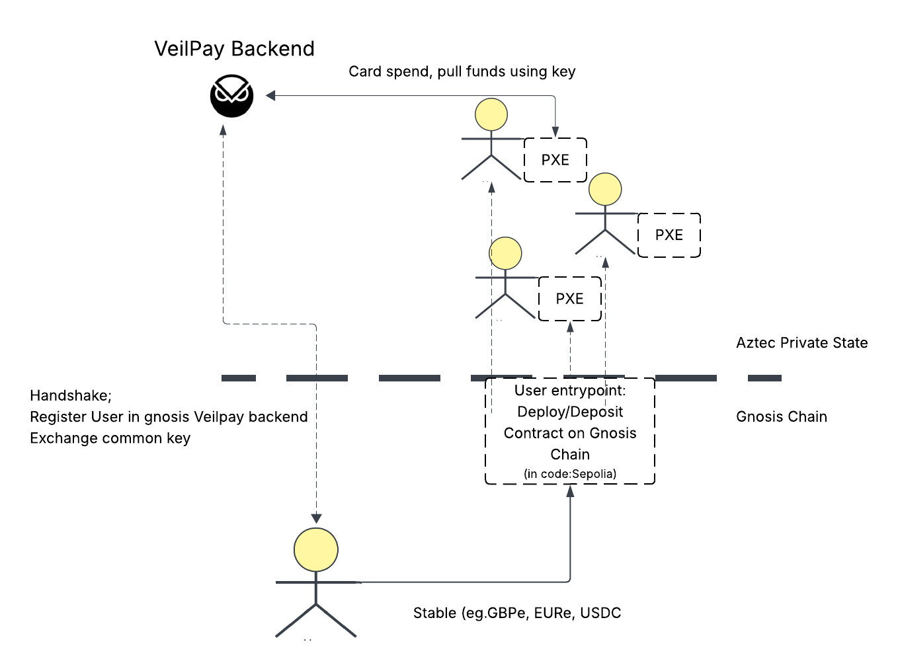

# Gnosis Veil Pay

A private Gnosis Pay. Allowing users to spend GBPe/EURe (or any stables) in real world without revealing their 
1. Funding wallets 
2. Amounts of transaction 
3. Historic & future spending patterns 

## Problem
Among all the noncustodial crypto cards none of them are private. They are susceptible to three privacy concerns: 
1. Privacy to Observer - All payments go through a single contract, so an observer knows (eg. the merchant you pay to or someone behind you) can look up the wallet that just spent the amount and see its future spending habits and historic. 
2. Can see funding wallets for any account. 
3. Amounts are public (they dont need to be). 

This article is a nice summary of it: https://tzedonn.substack.com/p/22-crypto-cards-will-get-you-robbed

## Solution

Aztec based Solution: Aztec rollup on EVM already has tooling for privacy sets This is the approach this repo followed. We wrote the gnosis pay logic of the smart contract wallet in Noir smart contract and deployed on Aztec. 

## Repository Structure  

1. Backend: implements the gnosis pay api methods relevent for initiating card. Also handles all Aztec-related operations (looking up user balance for auth, user db, deploy escrow) 
2. Contract: covers the Aztec Noir smart contracts with functinoality for (deploy, deposit, withdraw, time delays and rules module)
3. js: handling user functionality and testing of smart contracts. (Could form a basis for a mobile client or a web based ui/ux backend) 

